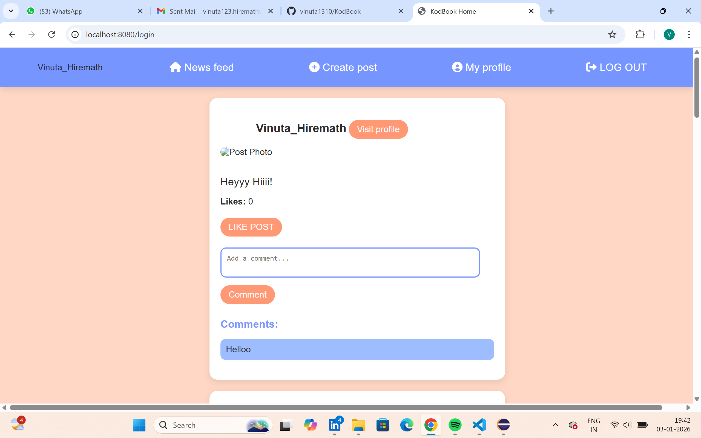
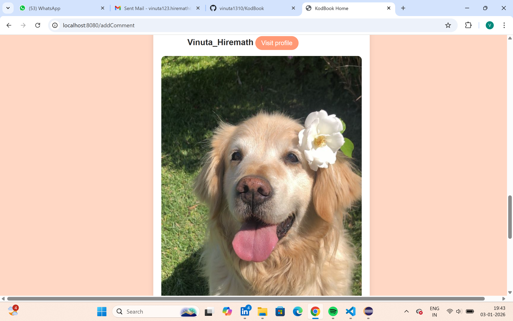
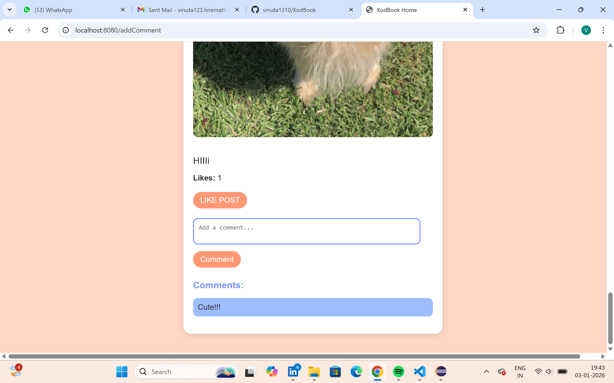

# KodBook 📘

KodBook is a full-stack social media web application designed to connect users through content sharing and interaction. It allows users to create profiles, post content, follow others, and engage through likes and comments. The project focuses on clean backend design, secure authentication, and a simple user-friendly interface.

## 🚀 Features

- User registration and secure login

- Create, update, delete, and view posts

- Like and comment on posts

- Follow users and view personalized feed

- Profile management (bio, profile picture, privacy settings)

- Admin module for user and content moderation

- Secure authentication using Spring Security

## 🛠️ Technology Stack
### Backend

- Java
- Spring Boot
- Spring Security
- Spring Data JPA

### Frontend

- HTML
- CSS
- JavaScript

### Database

- MySQL

### Tools

- IntelliJ IDEA / Eclipse
- VS Code
- Git & GitHub

## 📂 Modules Overview
### User Module

- User registration & authentication
- Encrypted password storage (BCrypt)
- Password reset functionality

### Profile Management

- Update profile details
- Upload/change profile picture
- Manage privacy settings

### Post Module

- Create, edit, delete posts
- View own posts and feed posts

### Like & Comment System

- Like posts
- Add and delete comments
- View engagement counts

### Admin Module

- Manage users
- Moderate posts and comments

## 📸 Screenshots
### Login Page


### Posts



### Likes And Comments



## ⚙️ Setup Instructions
### Prerequisites
- Java JDK 11 or higher
- MySQL Server
- Maven
- Git

### Backend Setup
1. Clone the repository
```bash
git clone <repository-url>
```
2. Open the project in IntelliJ IDEA or Eclipse
3. Configure MySQL database in application.properties
4. Run the application
```bash
mvn spring-boot:run
``` 

### Frontend Setup

1. Open the frontend folder in VS Code
2. Run HTML files using Live Server or any local server

## 🔐 Security

- Passwords encrypted using BCrypt
- Authentication and authorization via Spring Security
- Role-based access for Admin and Users

## 🧩 Learning Outcome

- Through this project, I gained hands-on experience in:
- Building RESTful APIs using Spring Boot
- Implementing authentication and authorization
- Designing relational databases with MySQL
- Integrating frontend with backend services
- Applying MVC architecture and clean coding practices